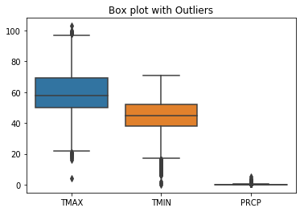
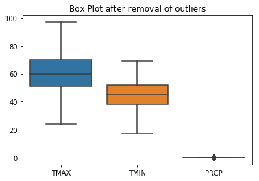
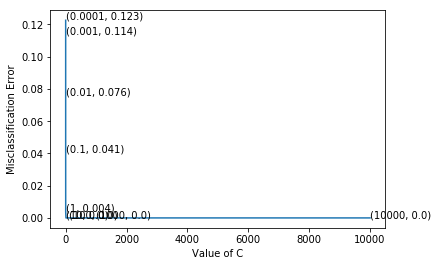
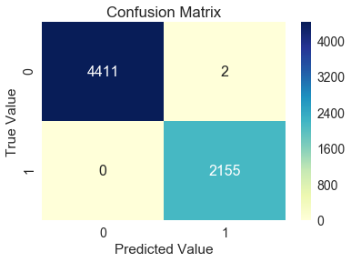

<p style="font-size:36px;text-align:center"> <b>Seattle Rain Predictions</b> </p>

<h1>1. Description </h1>

Besides coffee, grunge and technology companies, one of the things that Seattle is most famous for is how often it rains. This dataset contains complete records of daily rainfall patterns from January 1st, 1948 to December 12, 2017.

<p>The dataset contains five columns: </p>

* DATE = the date of the observation
* PRCP = the amount of precipitation, in inches
* TMAX = the maximum temperature for that day, in degrees Fahrenheit
* TMIN = the minimum temperature for that day, in degrees Fahrenheit
* RAIN = TRUE if rain was observed on that day, FALSE if it was not

<h1>2. Source </h1>

<p>https://www.kaggle.com/rtatman/did-it-rain-in-seattle-19482017 </p>
<p>This data was collected at the Seattle-Tacoma International Airport.</p>

<h1>3. Problem Statement </h1>

Based on given data set predict whether if there was rain observed on a day or not.

<h1> 4. EDA and Data Pre-Processing </h1>


```python
#Importing the required libraries

import pandas as pd
import numpy as np
import matplotlib.pyplot as plt
import seaborn as sns

from sklearn.preprocessing import Imputer
from sklearn.metrics import confusion_matrix,classification_report
from sklearn.preprocessing import StandardScaler
from sklearn.neighbors import LocalOutlierFactor
from sklearn.linear_model import LogisticRegression
from sklearn.grid_search import GridSearchCV
from sklearn.cross_validation import train_test_split


%matplotlib inline
```

    C:\Users\patil\Anaconda3\lib\site-packages\sklearn\cross_validation.py:41: DeprecationWarning: This module was deprecated in version 0.18 in favor of the model_selection module into which all the refactored classes and functions are moved. Also note that the interface of the new CV iterators are different from that of this module. This module will be removed in 0.20.
      "This module will be removed in 0.20.", DeprecationWarning)
    C:\Users\patil\Anaconda3\lib\site-packages\sklearn\grid_search.py:42: DeprecationWarning: This module was deprecated in version 0.18 in favor of the model_selection module into which all the refactored classes and functions are moved. This module will be removed in 0.20.
      DeprecationWarning)
    


```python
df=pd.read_csv('seattleWeather_1948-2017.csv')
df.shape
```


    (25551, 5)


The dataset  contains 25551 data points with 4 features and 1 class label.


```python
df.head()
```


<div>
<style scoped>
    .dataframe tbody tr th:only-of-type {
        vertical-align: middle;
    }

    .dataframe tbody tr th {
        vertical-align: top;
    }

    .dataframe thead th {
        text-align: right;
    }
</style>
<table border="1" class="dataframe">
  <thead>
    <tr style="text-align: right;">
      <th></th>
      <th>DATE</th>
      <th>PRCP</th>
      <th>TMAX</th>
      <th>TMIN</th>
      <th>RAIN</th>
    </tr>
  </thead>
  <tbody>
    <tr>
      <th>0</th>
      <td>1948-01-01</td>
      <td>0.47</td>
      <td>51</td>
      <td>42</td>
      <td>True</td>
    </tr>
    <tr>
      <th>1</th>
      <td>1948-01-02</td>
      <td>0.59</td>
      <td>45</td>
      <td>36</td>
      <td>True</td>
    </tr>
    <tr>
      <th>2</th>
      <td>1948-01-03</td>
      <td>0.42</td>
      <td>45</td>
      <td>35</td>
      <td>True</td>
    </tr>
    <tr>
      <th>3</th>
      <td>1948-01-04</td>
      <td>0.31</td>
      <td>45</td>
      <td>34</td>
      <td>True</td>
    </tr>
    <tr>
      <th>4</th>
      <td>1948-01-05</td>
      <td>0.17</td>
      <td>45</td>
      <td>32</td>
      <td>True</td>
    </tr>
  </tbody>
</table>
</div>


```python
df.describe()
```


<div>
<style scoped>
    .dataframe tbody tr th:only-of-type {
        vertical-align: middle;
    }

    .dataframe tbody tr th {
        vertical-align: top;
    }

    .dataframe thead th {
        text-align: right;
    }
</style>
<table border="1" class="dataframe">
  <thead>
    <tr style="text-align: right;">
      <th></th>
      <th>PRCP</th>
      <th>TMAX</th>
      <th>TMIN</th>
    </tr>
  </thead>
  <tbody>
    <tr>
      <th>count</th>
      <td>25548.000000</td>
      <td>25551.000000</td>
      <td>25551.000000</td>
    </tr>
    <tr>
      <th>mean</th>
      <td>0.106222</td>
      <td>59.544206</td>
      <td>44.514226</td>
    </tr>
    <tr>
      <th>std</th>
      <td>0.239031</td>
      <td>12.772984</td>
      <td>8.892836</td>
    </tr>
    <tr>
      <th>min</th>
      <td>0.000000</td>
      <td>4.000000</td>
      <td>0.000000</td>
    </tr>
    <tr>
      <th>25%</th>
      <td>0.000000</td>
      <td>50.000000</td>
      <td>38.000000</td>
    </tr>
    <tr>
      <th>50%</th>
      <td>0.000000</td>
      <td>58.000000</td>
      <td>45.000000</td>
    </tr>
    <tr>
      <th>75%</th>
      <td>0.100000</td>
      <td>69.000000</td>
      <td>52.000000</td>
    </tr>
    <tr>
      <th>max</th>
      <td>5.020000</td>
      <td>103.000000</td>
      <td>71.000000</td>
    </tr>
  </tbody>
</table>
</div>


As we can see from the above table , the max row has values that are far away from mean points.So this points must be outlier.
Here we can see the outlier present in the data set by plotting the box plot for the same.


```python
sns.boxplot(data=df[['TMAX','TMIN','PRCP']])
plt.title("Box plot with Outliers")
```


    Text(0.5,1,'Box plot with Outliers')





<p>The points which are present above and below the whiskers of the box plot are the outliers. We would use the Inter-Quartile Range(IQR) to remove this outliers.</p>

<p> The max point of the whisker is given by Q3+1.5*(IQR) and the min point is given by Q1-1.5*(IQR).</p>

<p>  where IQR=Q3-Q1  </p>
<p>  and Q1,Q3 are first and third quartiles respectively.


```python
tmin_Q=df['TMIN'].quantile([0.25,0.75])
tmax_Q=df['TMAX'].quantile([0.25,0.75])
prcp_Q=df['PRCP'].quantile([0.25,0.75])
```


```python
Q3_tmin=tmin_Q.get_values()[1]
Q1_tmin=tmin_Q.get_values()[0]

Q3_tmax=tmax_Q.get_values()[1]
Q1_tmax=tmax_Q.get_values()[0]

Q3_prcp=prcp_Q.get_values()[1]
Q1_prcp=prcp_Q.get_values()[0]
```


```python
iqr_tmin=Q3_tmin-Q1_tmin
iqr_tmax=Q3_tmax-Q1_tmax
iqr_prcp=Q3_prcp-Q1_prcp
```


```python
df=df.drop(df[df['TMIN']< Q1_tmin-1.5*iqr_tmin].index)
df=df.drop(df[(df['TMAX']< Q1_tmax-1.5*iqr_tmax) | (df['TMAX']> Q3_tmax+1.5*iqr_tmax)].index)
df=df.drop(df[(df['PRCP']< 0) | (df['PRCP']> Q3_prcp+1.5*iqr_prcp)].index)

df.shape
```


    (21893, 5)


After removal of outliers from dataset we have  21893  points and the box plot after removal of outlier is shown below.


```python
sns.boxplot(data=df[['TMAX','TMIN','PRCP']])
plt.title("Box Plot after removal of outliers")
```


    Text(0.5,1,'Box Plot after removal of outliers')





```python
#Some user-defined functions

def Rates(tn,fp,fn,tp):
    TPR=float(tp/(tp+fn))
    TNR=float(tn/(tn+fp))
    FPR=float(fp/(tn+fp))
    FNR=float(fn/(tp+fn))
    print("True Positive Rate or Sensitivity = %f" %(TPR*100))
    print("True Negative Rate or Specificity = %f" %(TNR*100))
    print("False Positive Rate or Fall-out = %f" %(FPR*100))
    print("False Negative Rate or Missclassification rate = %f" %(FNR*100))


def tran(Y):
    if Y==True:
        temp=1
    else:
        temp=0
    return temp        
       
Y=df['RAIN'].map(tran)    
```


```python
df=df.drop(['DATE','RAIN'],axis=1)
df.head()
```


<div>
<style scoped>
    .dataframe tbody tr th:only-of-type {
        vertical-align: middle;
    }

    .dataframe tbody tr th {
        vertical-align: top;
    }

    .dataframe thead th {
        text-align: right;
    }
</style>
<table border="1" class="dataframe">
  <thead>
    <tr style="text-align: right;">
      <th></th>
      <th>PRCP</th>
      <th>TMAX</th>
      <th>TMIN</th>
    </tr>
  </thead>
  <tbody>
    <tr>
      <th>4</th>
      <td>0.17</td>
      <td>45</td>
      <td>32</td>
    </tr>
    <tr>
      <th>7</th>
      <td>0.04</td>
      <td>48</td>
      <td>35</td>
    </tr>
    <tr>
      <th>8</th>
      <td>0.12</td>
      <td>50</td>
      <td>31</td>
    </tr>
    <tr>
      <th>10</th>
      <td>0.01</td>
      <td>42</td>
      <td>32</td>
    </tr>
    <tr>
      <th>11</th>
      <td>0.00</td>
      <td>41</td>
      <td>26</td>
    </tr>
  </tbody>
</table>
</div>


Now we will check whether there is NA present in the data or not.IF NA is present we would impute that NA with value equal to mean of the column.


```python
x=df['TMAX'].isna()
x.value_counts()
```


    False    21893
    Name: TMAX, dtype: int64


```python
x=df['TMIN'].isna()
x.value_counts()
```


    False    21893
    Name: TMIN, dtype: int64


```python
x=df['PRCP'].isna()
x.value_counts()
```


    False    21890
    True         3
    Name: PRCP, dtype: int64


As we can see that there 3 values in 'PRCP' with NA. We would impute it mean of the value in the column using Imputer function.


```python
im=Imputer()
X=im.fit_transform(df)
```

Now once we have the entire data-set its time we standardised the data using StandardScaler.


```python
sd=StandardScaler()
sd_data=sd.fit_transform(X)
```


```python
Y.value_counts()
```


    0    14569
    1     7324
    Name: RAIN, dtype: int64


Dividing the entire datasets into train and test data.We would use 70% of the entire data for training the model and 30% of the entire data for testing the model.


```python
X_train, X_test, y_train, y_test = train_test_split(sd_data, Y, test_size=0.3, random_state=42)
```

<h1> 4. Machine Learning Model </h1>

We would be using Logistic Regression as our model for training the data.

Logistic Regression as hyper-parameter 'C' whoes optimal value is find using cross-validation. We would be using Grid Search CV with cv=5.


```python
tuned_parameters = [{'C': [10**-4, 10**-3,10**-2,10**-1,10**0,10**1,10**2,10**3,10**4]}]
```


```python
#Using GridSearchCV
model = GridSearchCV(LogisticRegression(), tuned_parameters,
                     scoring = 'accuracy', cv=5,n_jobs=-1)
model.fit(X_train, y_train)
```


    GridSearchCV(cv=5, error_score='raise',
           estimator=LogisticRegression(C=1.0, class_weight=None, dual=False, fit_intercept=True,
              intercept_scaling=1, max_iter=100, multi_class='ovr', n_jobs=1,
              penalty='l2', random_state=None, solver='liblinear', tol=0.0001,
              verbose=0, warm_start=False),
           fit_params={}, iid=True, n_jobs=-1,
           param_grid=[{'C': [0.0001, 0.001, 0.01, 0.1, 1, 10, 100, 1000, 10000]}],
           pre_dispatch='2*n_jobs', refit=True, scoring='accuracy', verbose=0)


The optimal value of C is found using elbow-method


```python
cv_scores=[x[1] for x in model.grid_scores_]

#Calculating misclassification error
MSE = [1 - x for x in cv_scores]

#Finding best K
val=list(tuned_parameters[0].values())
optimal_value=val[0][MSE.index(min(MSE))]

print("\n The optimal value of C im Logistic Regression is %f ." %optimal_value)

```

    
     The optimal value of C im Logistic Regression is 10.000000 .
    


```python
# plot misclassification error vs C 
plt.plot(val[0], MSE)

for xy in zip(val[0], np.round(MSE,3)):
    plt.annotate('(%s, %s)' % xy, xy=xy, textcoords='data')

plt.xlabel('Value of C')
plt.ylabel('Misclassification Error')
plt.show()
```





```python
lr=LogisticRegression(C=optimal_value)
lr.fit(X_train,y_train)
```


    LogisticRegression(C=10, class_weight=None, dual=False, fit_intercept=True,
              intercept_scaling=1, max_iter=100, multi_class='ovr', n_jobs=1,
              penalty='l2', random_state=None, solver='liblinear', tol=0.0001,
              verbose=0, warm_start=False)


```python
y_pred=lr.predict(X_test)
```


```python
lr.score(X_test,y_test)
```


    0.9996954933008526


<p> The accuracy of the model comes out to be <b> 99.96 % </b>. </p>
<p> Lets plot the confusion matrix for the same to see FNR and FPR


```python
tn, fp, fn, tp =confusion_matrix(y_test, y_pred).ravel()
Rates(tn,fp,fn,tp)
```

    True Positive Rate or Sensitivity = 100.000000
    True Negative Rate or Specificity = 99.954679
    False Positive Rate or Fall-out = 0.045321
    False Negative Rate or Missclassification rate = 0.000000
    


```python
x=confusion_matrix(y_test, y_pred)
cm_df=pd.DataFrame(x,index=[0,1],columns=[0,1])

sns.set(font_scale=1.4,color_codes=True,palette="deep")
sns.heatmap(cm_df,annot=True,annot_kws={"size":16},fmt="d",cmap="YlGnBu")
plt.title("Confusion Matrix")
plt.xlabel("Predicted Value")
plt.ylabel("True Value")
```


    Text(29,0.5,'True Value')





<h1> 5. Conclusion </h1>

We were able to correctly predict the Rain in Seattle using Logistic Regression Model with an Accuracy of <b>99.96 % </b> 
